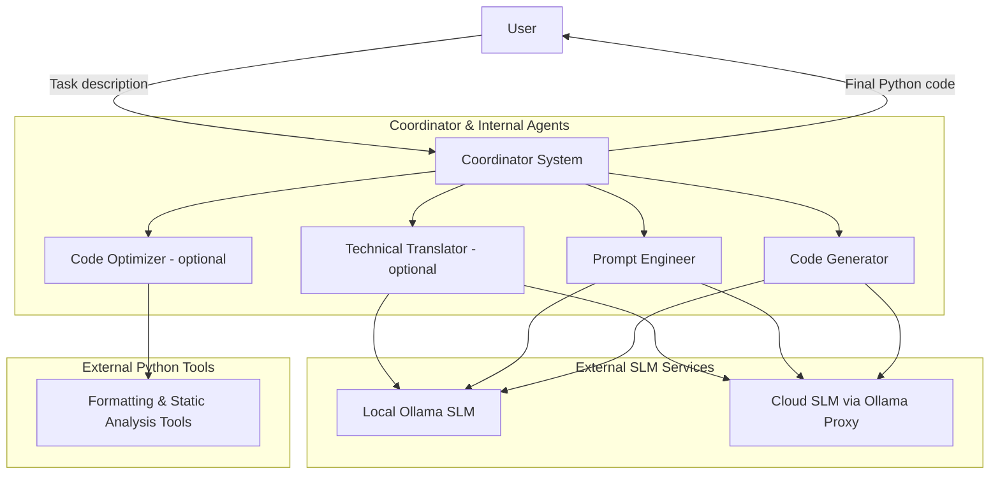
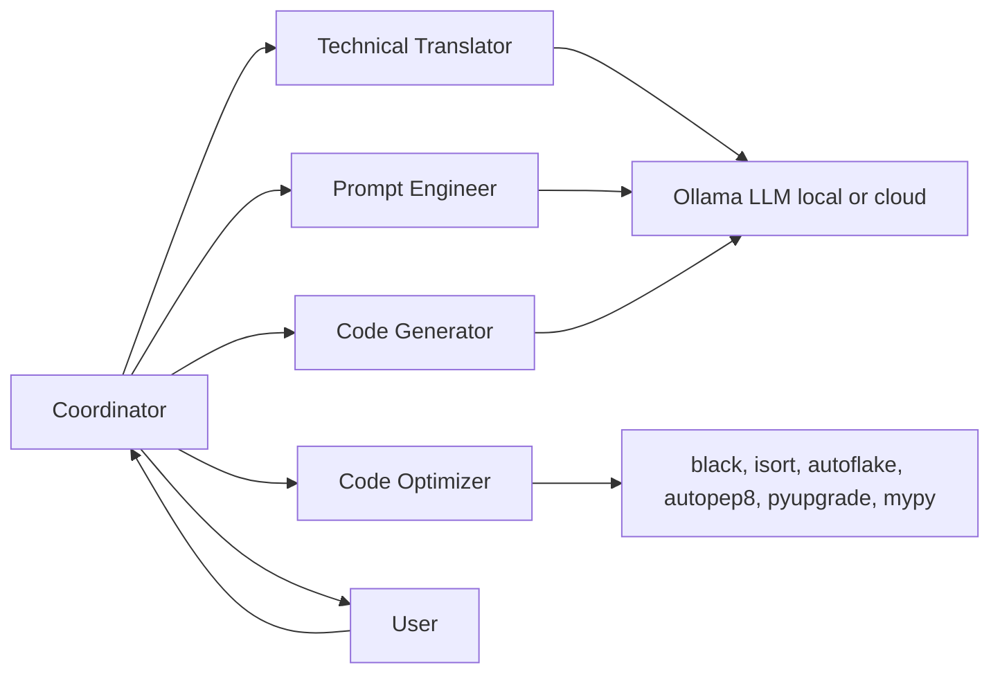
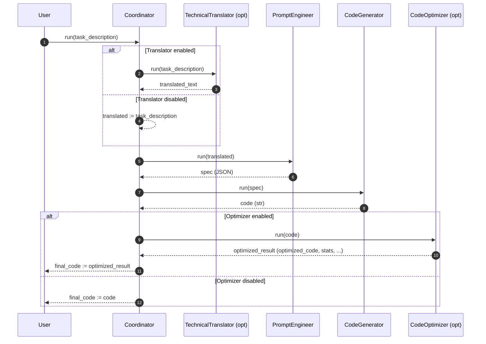
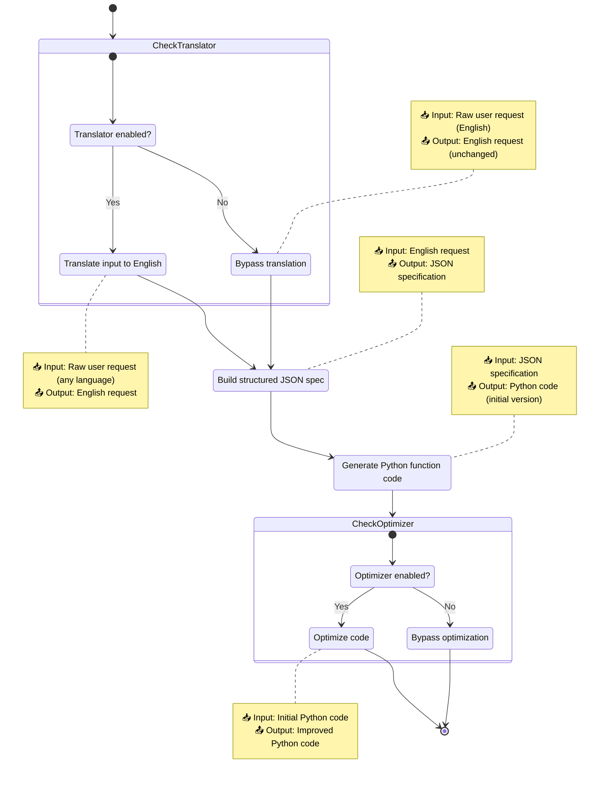
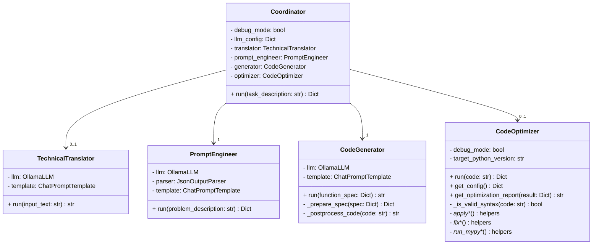
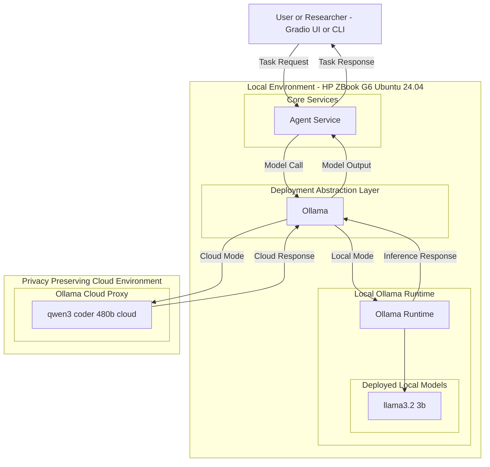
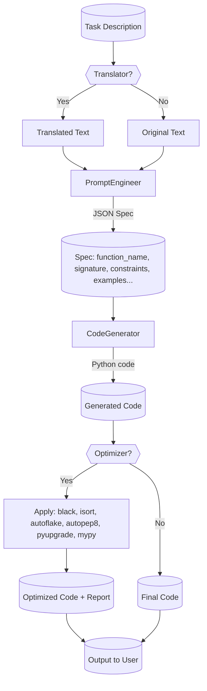
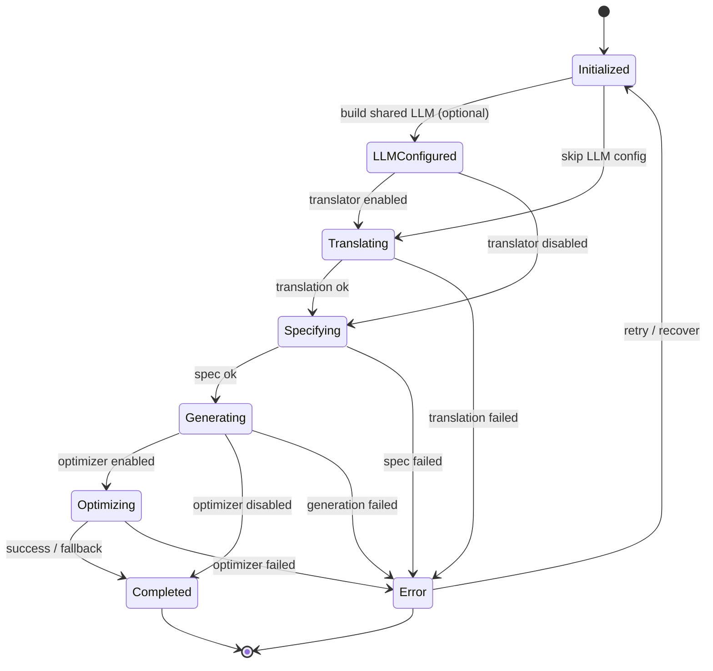

# CodeGenOpt Agents System — Comprehensive Diagrams

This document contains multiple diagrams describing the agents system located at `core/agents` (both cloud and local variants). Diagrams are authored in Mermaid to simplify rendering in Markdown previewers and the Mermaid Live Editor.

Contents:

- Context diagram
- Component diagram
- Sequence diagram (pipeline run)
- Activity diagram (control flow)
- Class diagram (key classes)
- Deployment diagram (local vs cloud)
- Data flow diagram
- Coordinator state machine

Render tips:

- VS Code: Install “Markdown Preview Mermaid Support” and open preview.
- Web: Copy a diagram block into https://mermaid.live/ to render.

---

## 1) Context Diagram

---

## 2) Component Diagram (Agents and Interactions)

---

## 3) Sequence Diagram (Coordinator.run)

---

## 4) Activity Diagram (Pipeline Control Flow)

---

## 5) Class Diagram (Key Classes and Relations)

---

## 6) Deployment Diagram (Local vs Cloud)

---

## 7) Data Flow Diagram

---

## 8) Coordinator State Machine

---

Notes:

- Translator and Optimizer are optional stages based on configuration.
- Local vs Cloud variants differ primarily by the LLM configuration and availability; class structure remains the same.
- Optimizer returns a rich result payload (optimized_code, stats, tools used, mypy suggestions). The Coordinator currently treats the optimizer output as final; ensure downstream usage considers its structure.
